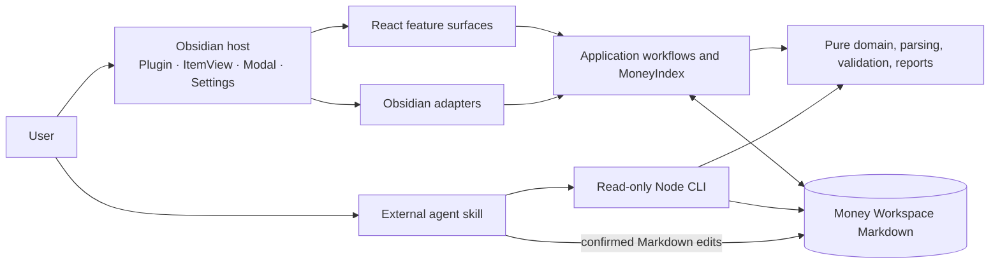

# Architecture overview

Money Manager has two separate execution boundaries: a local Obsidian plugin and an optional Node.js
companion CLI used by an external agent skill. Both interpret the same Markdown schema and pure
financial rules. Neither requires a backend, database, account system, telemetry, or remote rate
service.

## Boundaries and ownership

`src/main.ts` is the plugin composition and registration root. `src/obsidian/` owns public Obsidian
API adapters and the lifecycle shells for the ItemView, React Modal, and Settings tab. React feature
modules receive serializable snapshots, callbacks, and narrow services; they do not read or write
the Vault. Application workflows own setup, mutations, indexing, and projections. Domain modules
own exact money arithmetic, rates, paths, validation, and Ledger rules without importing Obsidian,
React, browser, filesystem, or clock APIs.

The CLI has its own `src/cli/main.ts` entrypoint and Node filesystem adapter. It reuses the pure
snapshot builder and validation contracts but is never imported by the Obsidian entrypoint. This
separation keeps Node APIs out of the mobile-compatible plugin runtime, as required by
[ADR-0004](../adr/0004-keep-the-plugin-local-only-and-mobile-compatible.md) and
[ADR-0006](../adr/0006-keep-the-companion-cli-read-only-and-share-validation.md).

## Index and read flow

One plugin-owned `MoneyIndex` reads the three known catalogs and Markdown descendants of the active
`Ledger/` root. Its immutable snapshot contains parsed catalogs, valid Entries, diagnostics,
Account Balances, latest Checkpoints, and completeness state. React observes it through
`useSyncExternalStore` and derives leaf-local filters without copying financial authority into a
second store.

Vault create, modify, rename, and delete events beneath the active root enter a cancellable 60 ms
batch. Affected Markdown paths are reread serially; non-Markdown path changes trigger a full read.
Root connection constructs and validates a candidate index before settings and subscriptions switch,
so data from two Money Workspaces is never merged.

## Mutation flow and failure safety

All mutations share one serialized queue. Before changing a document, a workflow refreshes the
index, rejects diagnostics on the target, parses the latest content, validates managed records, and
checks the caller's expected prior values. Obsidian writes use `Vault.process`; creation uses public
Vault APIs and creates missing parent folders. Serialization preserves unrelated frontmatter,
record extensions, and the Markdown body.

Single-document failures leave the durable file unchanged. Cross-Month Entry moves use copy-first
ordering: failure before the destination write preserves the source, while failure removing the
source preserves both UUID-identical copies and makes the conflict explicit. Account creation and
quick Category creation intentionally expose safe partial-success results instead of rolling back a
valid first write.

## Lifecycle, delivery, and operations

Plugin load normalizes settings, constructs services, and registers one view type, two commands, a
ribbon action, a settings tab, Vault events, and visibility refresh. The first configured read waits
for layout readiness. ItemView, Modal, and Settings shells own their React roots; plugin disposal
cancels batches, closes modals, unsubscribes indexes, and releases roots. Desktop and mobile use the
same domain and Vault adapter path, and `isDesktopOnly` remains false.

The production plugin bundles to `main.js`; local release packaging contains `main.js`,
`manifest.json`, and `styles.css`. The Node 22+ CLI bundles separately to `dist/money-manager.mjs`
while the portable skill remains a separate repository resource. CI runs formatting, lint, strict
TypeScript, unit/CLI tests, Storybook browser and accessibility tests, production builds, isolated
installation, and desktop/mobile-emulation Obsidian flows.
